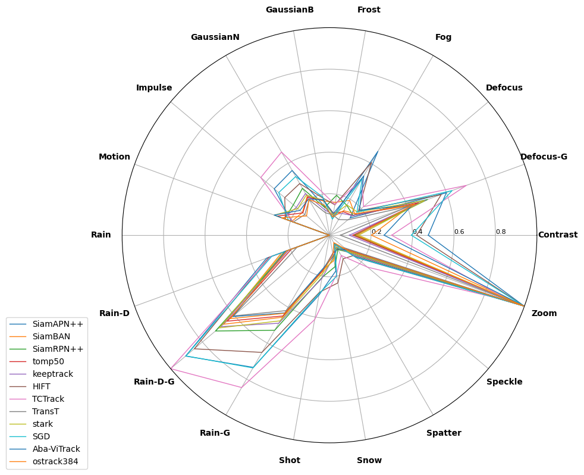
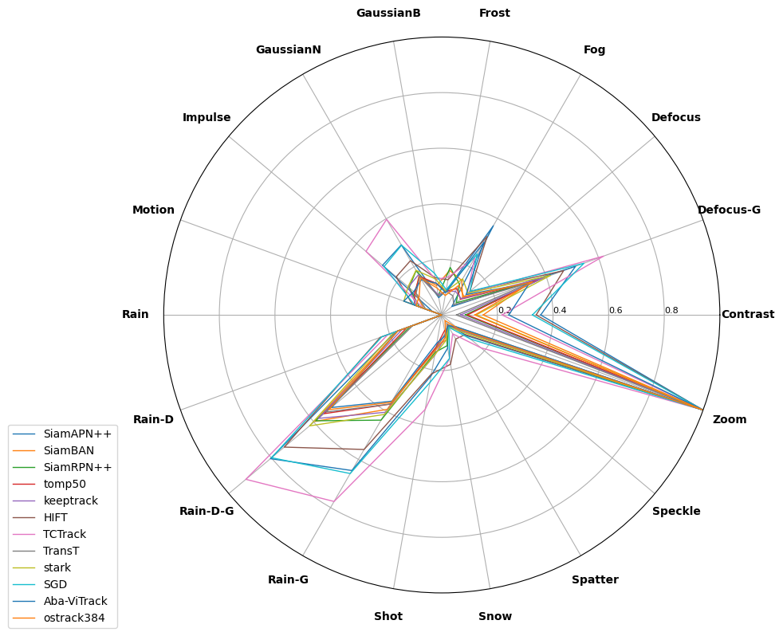

# Benchmarking the Robustness of UAV Tracking Against Common Corruptions

## Introduction
This repository presents a benchmark study focused on the robustness of UAV tracking methods against various common corruptions.


## How to use this repository
### Prepare clean dataset
1. **Download Datasets**:
   - Obtain the [**DTB70**](https://github.com/flyers/drone-tracking) and [**UAV123_10fps**](https://cemse.kaust.edu.sa/ivul/uav123) datasets, which serve as clean foundation for applying corruption. 

2. **Dataset Setup**:
   - Place the downloaded datasets, it's recommended to organize in a structured manner, such as:
     ```
     /data/DTB70
     /data/UAV123_10fps
     ```
### Requirements
1. **This project is tested with python 3.6+**
2. **Install the required Python packages**:
   ```
   pip install -r requirements.txt
   ```
   If requirements.txt is not provided, manually install the libraries using:
   ```
   pip install numpy torch matplotlib PIL imageio opencv-python imgaug scipy
   ```
3. **For ImageNet-C corruptions, follow the additional setup instructions provided in [ImageNet-C](https://github.com/hendrycks/robustness).**

### Generating Depth Maps

1. **Run Depth Map Generator**:
   - Execute the depth map generation script provided in the `runs/` directory. Adjust the script's parameters if necessary to point to your dataset locations.
   - Command for generate depth map for DTB70:
     ```bash
     python main.py --phase 'depth_estimation' --seq_dir '/yourpath/DTB70'
     ```
   - Command for generate depth map for UAV123_10fps:
     ```bash
     python main.py --phase 'depth_estimation' --seq_dir '/yourpath/UAV123_10fps'
     ```
### Download libaray Corruptions from ImageNet-C
- Command for install libaray from ImageNet-C:
```bash
git clone https://github.com/hendrycks/robustness.git
cd robustness/ImageNet-C/imagenet_c/imagenet_c
cd ..
pip install -e .
```

### Applying Corruptions

1. **Select Corruption Types**:
   - This benchmark includes 18 corruption types, each with three severity levels(1 3 5).  ['runs/generator'](https://github.com/Xiaoqiong-Liu/UAV-C/blob/main/runs/generator.py) by default generate 18 types of corruption together, you could modify corruption types(line 109) if necessary.

2. **Generate Corruptions**:
   - Example command for DTB70:
     ```bash
     python main.py --seq_dir /data/DTB70 --output_dir /data/UAV-C
     ```
   - Example command for UAV123_10fps:
     ```bash
     python main.py --seq_dir /data/UAV123_10fps --output_dir /data/UAV-C
     ```
   - Example output dataset structure of UAV-C
      ```
      UAV-C/
         ├── Animal1/
         │   ├── contrast/
         │   │   ├── 1/
         │   │   ├── 3/
         │   │   └── 5/
      ```

## Quantitative Results
We evaluated 12 trackers on the UAV-C benchmark. The table below summarizes the performance of each tracker across all types of corruptions. The last row is measured with the metric \( mS_{cor} \), averaged over all corruption types.



