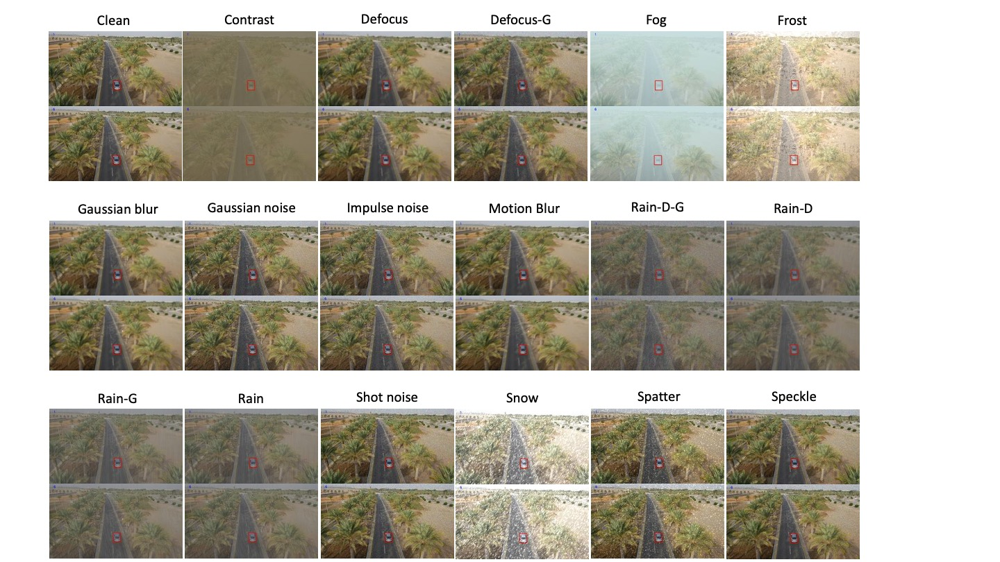

# Benchmarking the Robustness of UAV Tracking Against Common Corruptions

## Introduction
This repository presents a benchmark study focused on the robustness of UAV tracking methods against various common corruptions. Tracking robustness is crucial for practical UAV applications, where visual conditions can significantly vary due to environmental factors.

## Dataset
The benchmark dataset includes sequences of UAV footage subjected to a variety of synthetic corruptions, replicating real-world scenarios where visual quality might be compromised. Corruptions include following categories:
- Weather
- Sensor
- Blur
- Composite

Each specific corruption type has 3 levels of severity to simulate varying conditions.

## Quantitative Results
We evaluated 12 trackers on the UAV-C benchmark. The table below summarizes the performance of each tracker across all types of corruptions. Success performance is measured with the metric \( mS_{cor} \), averaged over all corruption types.

